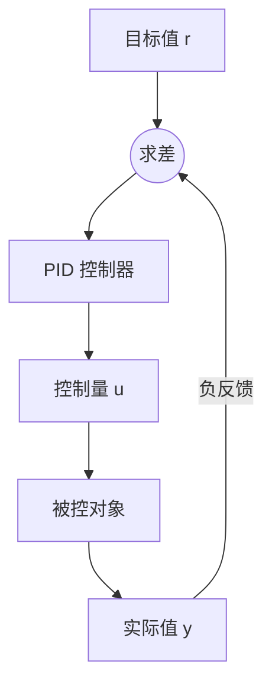

---
tags:
  - PID
  - 运动控制
date: 2026-09-10
---

# 基本概念

PID （Proportional–Integral–Derivative）是一种闭环反馈控制器。它根据目标值与实际值之间的误差计算控制量，用于使位置、速度、温度等物理量跟踪目标。



误差定义为：

$$e(t)=r(t)-y(t)$$

PID 的连续形式为：

$$u(t)=K_p e(t)+K_i\int_0^t e(\tau)\,\mathrm d\tau+K_d\frac{\mathrm d e(t)}{\mathrm d t}$$

| 项 | 作用 | 参数过大时的常见现象 |
| --- | --- | --- |
| P（比例） | 对当前误差立即作出反应 | 超调、震荡，甚至失稳 |
| I（积分） | 累积历史误差，消除稳态误差 | 积分饱和、响应变慢、超调增大 |
| D（微分） | 根据误差变化趋势提前制动 | 放大测量噪声和高频抖动 |

P、PI、PD 都是 PID 的常见简化形式。不是每个系统都需要同时使用三项。

# 离散实现

数字控制器以固定周期 $\Delta t$ 运行时，可以按下式更新：

$$I_k=I_{k-1}+e_k\Delta t$$

$$D_k=\frac{e_k-e_{k-1}}{\Delta t}$$

$$u_k=K_p e_k+K_i I_k+K_d D_k$$

一个包含积分限幅的最小 Python 实现：

```python
class PID:
    def __init__(self, kp, ki, kd, dt, integral_limit):
        self.kp = kp
        self.ki = ki
        self.kd = kd
        self.dt = dt
        self.integral_limit = integral_limit
        self.integral = 0.0
        self.prev_error = 0.0

    def update(self, target, measured):
        error = target - measured

        self.integral += error * self.dt
        self.integral = max(
            -self.integral_limit,
            min(self.integral, self.integral_limit),
        )

        derivative = (error - self.prev_error) / self.dt
        self.prev_error = error

        return (
            self.kp * error
            + self.ki * self.integral
            + self.kd * derivative
        )
```

实际系统通常还需要对输出限幅，并对微分项做低通滤波。否则执行器饱和后，积分项可能继续累积；测量噪声也可能被微分项明显放大。

# 腿式机器人中的 PD 关节控制

强化学习足式运控中，策略网络通常不直接输出电机力矩，而是输出关节目标位置的偏移量。底层 PD 控制器再将目标位置转换为力矩：

$$q_{\mathrm{target}}=q_{\mathrm{default}}+s_a a$$

$$\tau=K_p(q_{\mathrm{target}}-q)+K_d(\dot q_{\mathrm{target}}-\dot q)$$

当目标速度设为 $\dot q_{\mathrm{target}}=0$ 时：

$$\tau=K_p(q_{\mathrm{target}}-q)-K_d\dot q$$

对应配置为：

```python
class control(LeggedRobotCfg.control):
    # PD 驱动参数
    control_type = "P"
    stiffness = {"joint": 20.0}  # Kp, [N*m/rad]
    damping = {"joint": 0.5}     # Kd, [N*m*s/rad]

    # 目标角度 = 默认角度 + action_scale * 策略动作
    action_scale = 0.25

    # 每输出一次策略动作，执行 4 个仿真步
    decimation = 4
```

## 参数含义

| 配置 | 含义 | 工程影响 |
| --- | --- | --- |
| `control_type = "P"` | 使用位置目标生成力矩 | 名称为 `P`，但同时设置 `damping` 时，实际计算是 PD |
| `stiffness = 20.0` | 比例增益 $K_p$ | 误差 $1\ \mathrm{rad}$ 产生 $20\ \mathrm{N\cdot m}$ 的比例力矩，限幅前成立 |
| `damping = 0.5` | 微分增益 $K_d$ | 抵消过快的关节运动，抑制震荡 |
| `action_scale = 0.25` | 策略动作的缩放系数 | 若 $a\in[-1,1]$，目标角度最多在默认角附近偏移 $0.25\ \mathrm{rad}$ |
| `decimation = 4` | 策略控制周期包含 4 个仿真步 | 策略频率是物理仿真频率的 $1/4$ |

若仿真时间步长为 $\Delta t_{\mathrm{sim}}$，则策略周期和频率为：

$$\Delta t_{\mathrm{policy}}=\mathrm{decimation}\cdot\Delta t_{\mathrm{sim}}$$

$$f_{\mathrm{policy}}=\frac{1}{\Delta t_{\mathrm{policy}}}$$

PD 运行在每个仿真步，而策略动作在 4 个仿真步内保持不变。这种高频底层跟踪与低频策略决策的分层结构，可以降低策略推理开销，同时保持关节控制稳定。

# 调参要点

1. 先将 $K_i$ 设为 0，从较小的 $K_p$ 开始增大，直到跟踪速度可接受。
2. 增大 $K_d$ 抑制超调和震荡，但要观察速度噪声和力矩抖动。
3. 只有系统存在持续稳态误差时才引入 $K_i$，并配合积分限幅或抗饱和。
4. 同时检查力矩限制、关节限位、控制频率和传感器噪声；仅改增益不能解决所有不稳定问题。

> 在腿式机器人关节位置控制中，通常优先使用 PD，而不是完整 PID。机器人需要在与环境接触时保留一定柔顺性，积分项也容易在力矩饱和或关节被阻挡时持续累积。
