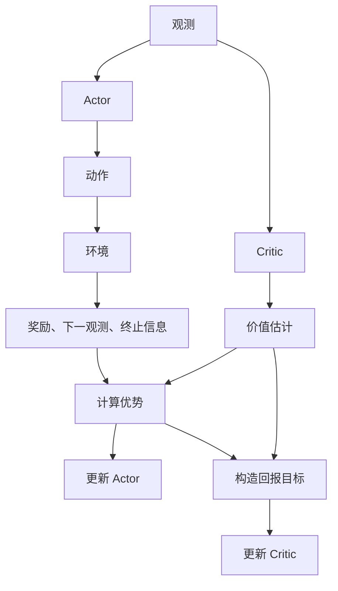

---
tags:
  - 强化学习
date: 2026-08-17
---

# 1. 先看整体：一轮训练在做什么

PPO（近端策略优化）是一种强化学习算法：让策略与环境交互，再用采到的数据改善动作选择。它的核心特点是：**一批数据可以训练多轮，但要抑制过大的策略调整。**

先认识两个角色：

| 角色 | 输入 | 输出 | 学习任务 |
| --- | --- | --- | --- |
| Actor（策略网络） | 当前观测 | 动作分布，从中采样动作 | 让表现好的动作更容易被选中 |
| Critic（价值网络） | 当前观测 | 价值估计 $V(s)$ | 预测从这里出发能获得多少长期回报 |

下面是简化的数据流。**优势由训练程序计算，不是 Actor 的输出；回报目标是训练 Critic 的参考答案。**

整个训练循环是：

**采一批数据 → 计算优势和回报目标 → 更新 Actor、Critic 多轮 → 用更新后的 Actor 重新采样。**

采样阶段暂时不更新网络；训练阶段不重新执行这批动作，而是反复读取已经记录的数据。训练时固定旧概率、优势和回报目标，变化的是当前 Actor、Critic 的参数及其输出。

# 2. 奖励、价值与优势：怎样评价一个动作

## 奖励看一步，回报看后续

一次交互记为 $(s_t,a_t,r_t,s_{t+1})$：当前状态、执行的动作、得到的奖励、下一状态。下文用 $s_t$ 统一表示输入信息；实际机器人通常使用传感器观测。

- **奖励 $r_t$**：这一步得到多少分。
- **回报 $G_t$**：从这一步开始，后续奖励的折扣总和。

$$
G_t=r_t+\gamma r_{t+1}+\gamma^2r_{t+2}+\cdots
$$

$\gamma$ 是折扣因子，越接近 $1$ 越重视远期奖励。策略追求的是高的**期望回报**，而不只是某一步奖励。

## V 是平均水平，Q 是指定动作后的水平

价值总是相对于某个策略定义的：

| 量 | 含义 |
| --- | --- |
| $V^\pi(s)$ | 从状态 $s$ 开始，按策略 $\pi$ 行动，平均能得到多少回报 |
| $Q^\pi(s,a)$ | 在状态 $s$ 先做动作 $a$，之后按策略 $\pi$ 行动，平均能得到多少回报 |
| $A^\pi(s,a)=Q^\pi(s,a)-V^\pi(s)$ | 这个动作比当前策略在该状态下的平均表现好多少 |

例如，机器人在当前姿态下平均能拿 $10$ 分，而某个迈步动作的预期回报是 $12$ 分，那么它的优势就是 $12-10=2$。

**正优势：倾向于增加该动作的概率；负优势：倾向于降低该动作的概率。** 奖励为正不代表优势为正，因为动作可能仍然低于平均水平。

真实的价值和优势通常不知道。本文用 Critic 预测 $V$，再结合奖励估计优势，不需要额外训练 Q 网络。下面用 $\hat A_t$ 表示优势的估计值。

# 3. 训练依据从哪里来：TD、GAE 和回报目标

## 用一步结果估计优势

没有采完未来的奖励，也可以用 Critic 补上后续回报：

$$
\delta_t=
\underbrace{r_t+\gamma(1-d_t)V_{\mathrm{old}}(s_{t+1})}_{这次动作后的回报估计}
-\underbrace{V_{\mathrm{old}}(s_t)}_{原来的平均水平估计}
$$

- $V_{\mathrm{old}}$：采样时的 Critic 给出的价值预测，本轮训练中作为固定参照，不要求另建一个网络。
- $d_t$：任务真正终止时为 $1$，否则为 $0$；终止后不再补后续价值。
- $\delta_t$：一步 TD（时序差分）误差，可用作优势估计。

例如 $r_t=3$、$\gamma=0.9$，当前价值为 $10$，下一状态价值也为 $10$，且未终止：

$$
\delta_t=3+0.9\times10-10=2
$$

这次结果比原预测好 $2$ 分。用价值估计补上尚未采到的后续回报，叫 **bootstrap**。如果等待回合结束，直接累加实际奖励，则是蒙特卡洛（MC）方法。

## 真正终止与采样截断

是否保留后续价值，取决于任务有没有真正结束，而不是数据有没有采完：

- **真正终止**：例如任务规定摔倒即结束，$d_t=1$，不再有后续奖励，TD 回报目标只剩 $r_t$。
- **采样截断**：例如采满 256 步就暂停采样，但任务还能继续，$d_t=0$，仍用末端状态的价值补上后续回报。

如果因外部时间限制截断后重置环境，应使用**重置前最后一个状态**的价值，而不是新回合初始状态。若任务本身规定固定时长结束，则属于真正终止，剩余时间通常也应纳入状态。

## GAE：不只看一步

一步结果可能偶然好或坏。GAE（广义优势估计）把后续多步的 TD 误差也纳入评价：

$$
\hat A_t=\delta_t+(\gamma\lambda)\delta_{t+1}
+(\gamma\lambda)^2\delta_{t+2}+\cdots
$$

这里只累计同一回合内当前采样片段的误差。$\lambda\in[0,1]$ 控制看多远：

- $\lambda=0$：只看当前一步 TD 误差。
- $\lambda$ 越大：越多利用后续结果，通常减少对近期价值预测的依赖，但增加采样波动。

**$\gamma$ 决定奖励怎样折扣，$\lambda$ 决定优势怎样估计。**

计算 GAE 时可从后向前递推：

$$
\hat A_t=\delta_t+\gamma\lambda c_t\hat A_{t+1}
$$

$c_t=1$ 表示下一条 TD 误差仍在同一可累计片段中，否则为 $0$。递推不能跨过回合重置；采样片段末尾也停止递推，但若只是截断，末步的 $\delta_t$ 仍应保留后续价值。**停止累计优势，不等于取消 bootstrap。**

## Critic 的回报目标

优势表示“比原预测好多少”，把原预测加回来，就能构造 Critic 要拟合的回报目标：

$$
\hat R_t=\hat A_t+V_{\mathrm{old}}(s_t)
$$

例如原预测是 $10$，优势估计为 $2$，参考答案就是 $12$。**它是根据数据构造的估计，不是绝对正确的真实值。**

到这里，同一批数据得到两份训练依据：Actor 使用 $\hat A_t$，Critic 使用 $\hat R_t$。

# 4. Actor 和 Critic 分别怎样更新

训练就是调整网络参数，使损失减小。用 $\theta$ 表示 Actor 参数，$\phi$ 表示 Critic 参数；$\hat{\mathbb E}_t$ 表示对当前批次取平均。

## Critic：让预测靠近回报目标

$$
L_{\mathrm{value}}(\phi)
=\hat{\mathbb E}_t[(V_\phi(s_t)-\hat R_t)^2]
$$

若目标是 $12$，当前预测是 $10$，更新就会推动预测向 $12$ 靠近。求梯度时，$\hat R_t$ 固定，只有当前预测参与求导。

## Actor：让动作概率朝优势指示的方向变化

策略 $\pi_\theta(a\mid s)$ 表示给定状态下的动作概率。连续动作通常使用高斯等分布，此时它表示概率密度。

先看一个普通 Actor-Critic 使用的策略损失：

$$
L_{\mathrm{actor}}(\theta)
=-\hat{\mathbb E}_t[\log\pi_\theta(a_t\mid s_t)\hat A_t]
$$

固定优势后，正优势样本倾向于推动动作概率上升，负优势样本倾向于推动动作概率下降。这里不需要让 Actor 把优势作为输入，**优势是在网络外部构造损失时使用的权重。**

优化器根据损失的梯度更新参数，而不是把损失数值直接加到参数上。PPO 保留 Critic 的基本训练方式，主要改变下面这个 Actor 更新目标。

# 5. PPO 的两个核心改动：概率比和裁剪

## 为什么要改 Actor 的目标

与环境交互有成本，因此希望一批数据能训练多轮。但第一次更新后，Actor 已经变了，数据却仍来自采样时的旧策略。

**旧策略负责提供数据，当前策略负责在这批数据上学习。** “用旧数据”不是“Actor 不更新”。

## 概率比：重新评价旧数据里的动作

对记录下来的同一个状态 $s_t$、同一个动作 $a_t$，计算：

$$
\rho_t(\theta)
=\frac{\pi_\theta(a_t\mid s_t)}{\pi_{\mathrm{old}}(a_t\mid s_t)}
$$

分母是采样时记录的旧概率，固定不变；分子由当前 Actor 重新计算，会随训练变化。例如旧概率为 $0.2$，当前概率为 $0.24$，概率比就是 $1.2$。

用概率比给旧样本重新加权，可构造希望最大化的目标：

$$
J_{\mathrm{sur}}(\theta)=\hat{\mathbb E}_t[\rho_t(\theta)\hat A_t]
$$

直观上，旧概率乘以“新概率 / 旧概率”就变成了新概率，所以这种加权能调整动作出现比例不同带来的影响。

但这不能凭空补出新策略会遇到的状态。例如旧策略迈小步，数据多是稳定姿态；新策略迈大步后可能身体前倾，旧数据里却没有对应经验。**因此只能有限复用，然后重新采样。**

## 裁剪：不再鼓励过大的调整

如果只最大化 $\rho_t\hat A_t$，可能对同一批数据反复强化，过度相信有噪声的优势估计。PPO 为此设置裁剪幅度 $\epsilon$，它是人为设定的参数，不是网络输出。

概率比以 $1$ 为基准，裁剪区间是 $[1-\epsilon,1+\epsilon]$。取 $\epsilon=0.2$，区间就是 $[0.8,1.2]$：指概率相对旧值变化 $20\%$，不是概率直接加减 $0.2$。

仍设旧概率为 $0.2$，分别看正负优势：

| 优势 | 新概率 | 概率比 | 未裁剪目标 $\rho_t\hat A_t$ | PPO 使用的目标值 |
| --- | --- | --- | --- | --- |
| $+2$ | $0.22$ | $1.1$ | $2.2$ | $2.2$ |
| $+2$ | $0.24$ | $1.2$ | $2.4$ | $2.4$ |
| $+2$ | $0.30$ | $1.5$ | $3.0$ | $2.4$ |
| $-2$ | $0.18$ | $0.9$ | $-1.8$ | $-1.8$ |
| $-2$ | $0.16$ | $0.8$ | $-1.6$ | $-1.6$ |
| $-2$ | $0.10$ | $0.5$ | $-1.0$ | $-1.6$ |

目标要最大化。因此，正优势动作提高到旧概率的 $1.2$ 倍后、负优势动作降低到 $0.8$ 倍后，继续沿这个方向调整，都不再增加该样本的目标值。

## 用一个公式表达

$\operatorname{clip}(x,l,u)$ 把 $x$ 截到 $[l,u]$ 内：低于下限取下限，高于上限取上限，区间内不变。

$$
J_{\mathrm{clip}}(\theta)
=\hat{\mathbb E}_t\left[
\min\left(
\rho_t(\theta)\hat A_t,
\operatorname{clip}(\rho_t(\theta),1-\epsilon,1+\epsilon)\hat A_t
\right)
\right]
$$

为什么还要取 $\min$？因为**只想取消过度改善的额外鼓励，不想取消朝错误方向变化的惩罚。**

例如优势为 $+2$，概率比却降到 $0.5$：原始项为 $1$，裁剪项为 $1.6$。取较小的原始项，才能让概率继续下降时目标继续变差，而不是进入平坦区。

Actor 最小化的损失就是：

$$
L_{\mathrm{actor}}=-J_{\mathrm{clip}}
$$

> 裁剪修改的是目标，不是强制概率比留在区间内。其他样本通过共享参数仍可能改变该动作的概率，所以裁剪不保证策略变化小，也不保证真实回报每次都提高。

**PPO 的核心不是新增一个网络，而是用裁剪概率比目标更新 Actor，允许当前批次被相对保守地复用多轮。**

# 6. 用一批数据串起完整训练

## 先算好固定的训练依据

假设采到两步轨迹，第二步后真正终止，取 $\gamma=0.9$、$\lambda=0.8$：

| 时间步 | 奖励  | 旧价值 | 下一状态旧价值 | 是否真正终止 |
| --- | --- | --- | ------- | ------ |
| $0$ | $1$ | $2$ | $1$     | 否      |
| $1$ | $2$ | $1$ | $0$     | 是      |

先算 TD 误差，再从后向前算 GAE：

$$
\begin{aligned}
\delta_0&=1+0.9\times1-2=-0.1, & \delta_1&=2-1=1,\\
\hat A_1&=1, & \hat A_0&=-0.1+0.9\times0.8\times1=0.62.
\end{aligned}
$$

第一步单看 TD 误差为负，结合下一步结果后，优势估计变为正。对应的 Critic 回报目标是：

$$
\hat R_0=0.62+2=2.62,\qquad \hat R_1=1+1=2.
$$

## 再用这批数据训练多轮

假设第一步动作的旧概率为 $0.2$，某次更新后当前概率为 $0.26$。取 $\epsilon=0.2$：

$$
\rho_0=0.26/0.2=1.3,
\qquad
j_0=\min(1.3\times0.62,\;1.2\times0.62)=0.744.
$$

这个样本的 Actor 损失贡献为 $-0.744$，但它已经进入裁剪平坦区，单独这一项不会继续推动概率上升。Critic 则继续向固定目标 $2.62$ 拟合。

实际训练会将一批数据分成小批次，合并样本的梯度更新网络。完整遍历这批数据一次叫一个 **epoch**。

最后，把一轮 PPO 浓缩为五步：

1. **采样**：保存状态、动作、奖励、边界信息、旧动作概率和旧价值。
2. **计算目标**：用奖励和旧价值算 GAE，再构造 $\hat R_t$。
3. **重新计算**：当前 Actor 计算已记录动作的概率，当前 Critic 计算价值预测。
4. **更新多轮**：Actor 最小化 $-J_{\mathrm{clip}}$，Critic 最小化价值平方误差；旧概率、优势和回报目标始终固定。
5. **重新采样**：用更新后的 Actor 与环境交互，开始下一轮。
