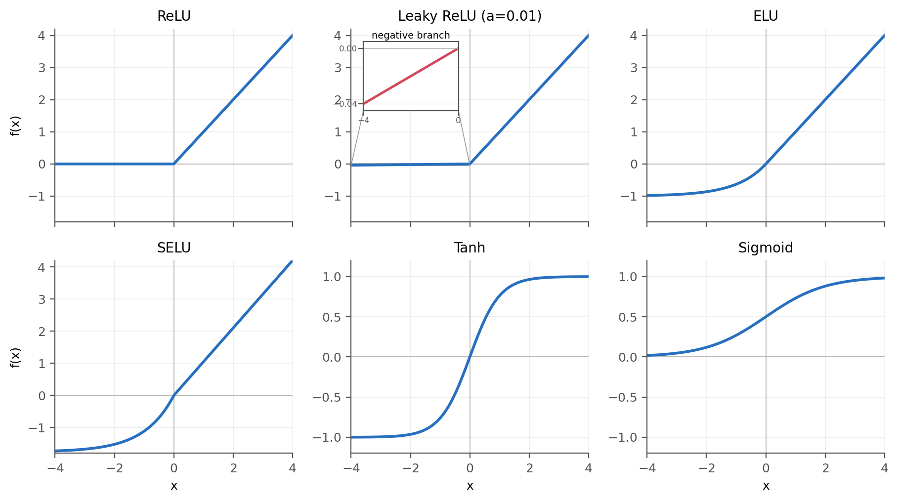

---
tags:
  - 神经网络
  - 深度学习
  - 强化学习
date: 2026-09-16
---

# 激活函数

激活函数对神经元的线性输出 $z=Wx+b$ 进行非线性变换。没有激活函数时，多层线性变换仍然等价于一层线性变换，网络无法表示复杂的非线性关系。



图中 Leaky ReLU 使用 PyTorch 的默认斜率 $a=0.01$，负半轴只有很小的倾斜，因此另用局部放大图展示。

## 选择原则

- 隐藏层默认优先使用 ReLU；如果出现大量“死亡神经元”，可以尝试 Leaky ReLU 或 ELU。
- SELU 只有在网络结构和初始化等条件匹配时才能体现自归一化效果，不应直接当作 ReLU 的通用替代。
- Tanh 和 Sigmoid 在输入绝对值较大时容易饱和，深层网络的隐藏层一般不优先使用。
- 输出层的激活函数由输出的含义决定，不能只根据训练速度选择。

## ReLU

$$
\operatorname{ReLU}(x)=\max(0,x)
$$

ReLU 计算简单，正半轴梯度恒为 $1$，是隐藏层最常用的默认选择。

当 $x<0$ 时其输出和梯度都为 $0$。如果某个神经元长期落在负半轴，参数可能不再更新，这种现象称为“死亡 ReLU”。

## Leaky ReLU

$$
\operatorname{LeakyReLU}(x)=
\begin{cases}
x, & x\ge 0 \\
ax, & x<0
\end{cases}
$$

$a$ 是较小的正数，PyTorch 中 `nn.LeakyReLU()` 的默认值为 $0.01$。负半轴保留小梯度，可以减少死亡神经元，但会额外引入斜率超参数。

## ELU

$$
\operatorname{ELU}(x)=
\begin{cases}
x, & x>0 \\
\alpha(e^x-1), & x\le 0
\end{cases}
$$

ELU 的负半轴平滑且输出可为负，默认 $\alpha=1$。它不会像 ReLU 一样在整个负半轴将梯度置零，但指数运算的计算成本略高。

## SELU

$$
\operatorname{SELU}(x)=
\lambda
\begin{cases}
x, & x>0 \\
\alpha(e^x-1), & x\le 0
\end{cases}
$$

SELU 在 ELU 的基础上加入缩放系数，其固定参数约为 $\alpha=1.6733$、$\lambda=1.0507$。它的目标是让各层输出逐渐接近零均值和单位方差。

要获得这种自归一化性质，通常需要同时使用 LeCun normal 初始化，并避免将 BatchNorm 和普通 Dropout 随意混入网络；需要 Dropout 时应使用 `nn.AlphaDropout`。

## Tanh

$$
\tanh(x)=\frac{e^x-e^{-x}}{e^x+e^{-x}}
$$

Tanh 将输出限制在 $(-1,1)$，且以 $0$ 为中心。它适合表示同时包含正负方向的有界输出，例如将连续动作压缩到归一化动作区间。

当 $|x|$ 较大时，Tanh 的梯度接近 $0$，深层网络中可能出现梯度消失。

## Sigmoid

$$
\sigma(x)=\frac{1}{1+e^{-x}}
$$

Sigmoid 将输出限制在 $(0,1)$，适合表示二元概率或独立门控系数。它的输出不以零为中心，且在两端存在饱和问题，因此一般不用作深层网络的默认隐藏层激活函数。

## CReLU

CReLU（Concatenated ReLU）同时保留输入的正、负响应：

$$
\operatorname{CReLU}(x)=[\operatorname{ReLU}(x),\operatorname{ReLU}(-x)]
$$

拼接后的特征维度会扩大一倍。因此，`crelu` 不能直接返回 `nn.ReLU()`，否则它与普通 ReLU 完全相同。
实现时 `dim` 应指向特征维。如果输入是卷积特征 `[N, C, H, W]`，应使用 `dim=1`。

## 隐藏层与输出层

| 位置或任务 | 常用选择 | 原因 |
| --- | --- | --- |
| 普通隐藏层 | ReLU | 简单、训练稳定，适合作为默认基线 |
| 出现死亡 ReLU | Leaky ReLU 或 ELU | 负半轴仍保留梯度 |
| 二分类概率 | Sigmoid | 单个输出在 $(0,1)$ 内 |
| 多分类概率 | Softmax | 各类概率之和为 $1$ |
| 连续动作均值 | Tanh 或线性输出 | 取决于动作是否需要限幅 |
| 价值函数 | 线性输出 | 价值估计通常不应被限制在固定区间 |

> Tanh 只能保证网络输出在 $(-1,1)$。实际动作范围为 $[a_{\min},a_{\max}]$ 时，还需要对输出进行缩放和平移。

## PyTorch 实现

下面的工厂函数可根据字符串创建激活层：

```python
import torch
from torch import nn


class CReLU(nn.Module):
    def __init__(self, dim=-1):
        super().__init__()
        self.dim = dim

    def forward(self, x):
        return torch.cat((torch.relu(x), torch.relu(-x)), dim=self.dim)


def get_activation(act_name: str) -> nn.Module:
    name = act_name.lower()

    activations = {
        "elu": nn.ELU,
        "selu": nn.SELU,
        "relu": nn.ReLU,
        "crelu": CReLU,
        "lrelu": nn.LeakyReLU,
        "tanh": nn.Tanh,
        "sigmoid": nn.Sigmoid,
        "identity": nn.Identity,
    }

    try:
        return activations[name]()
    except KeyError as error:
        supported = ", ".join(activations)
        raise ValueError(
            f"Unsupported activation: {act_name}. Supported: {supported}"
        ) from error
```

与返回 `None` 相比，对无效名称直接抛出异常可以让配置错误在初始化阶段暴露，避免错误延迟到前向传播时才出现。

# MLP 与 RNN

MLP（Multilayer Perceptron，多层感知机）通常对一个固定长度向量进行前向计算；RNN（Recurrent Neural Network，循环神经网络）通过隐藏状态在时间步之间传递信息。二者的核心区别是网络内部是否显式保留历史状态。

## MLP

MLP 由多个全连接层和非线性激活函数组成。以两层网络为例：

PyTorch 中 `nn.Module`、`nn.Linear` 和 `nn.Sequential` 等接口的用法见 [[PyTorch]]。

$$
h=\phi(W_1x+b_1)
$$

$$
y=W_2h+b_2
$$

每次输出只由本次输入 $x$ 和当前参数决定。如果分别将 $x_{t-1}$ 和 $x_t$ 输入普通 MLP，网络不会自动记住上一次的计算结果。

MLP 适合处理固定长度且当前观测已包含决策所需信息的输入。同一批样本之间没有时序依赖，因此容易并行计算。

```python
mlp = nn.Sequential(
    nn.Linear(obs_dim, 256),
    nn.ReLU(),
    nn.Linear(256, action_dim),
)

# obs: [batch, obs_dim]
output = mlp(obs)  # [batch, action_dim]
```

## RNN

RNN 在时间步 $t$ 同时接收当前输入 $x_t$ 和上一时刻的隐藏状态 $h_{t-1}$：

$$
h_t=\phi(W_xx_t+W_hh_{t-1}+b)
$$

$$
y_t=W_yh_t+b_y
$$

$h_t$ 是对当前输入和过去信息的压缩表示。同一组 RNN 参数会在所有时间步上重复使用，因此可以处理不同长度的序列。

普通 RNN 在长序列上容易出现梯度消失或梯度爆炸。LSTM 和 GRU 通过门控结构改善长期信息保留，实际任务中通常比基础 RNN 更常用。

```python
rnn = nn.GRU(
    input_size=obs_dim,
    hidden_size=128,
    batch_first=True,
)

# sequence: [batch, time, obs_dim]
# hidden: [num_layers, batch, hidden_size]
output, next_hidden = rnn(sequence, hidden)
```

`output` 保留每个时间步的输出，形状为 `[batch, time, hidden_size]`；`next_hidden` 是序列末尾的隐藏状态，可以传给后续序列。

## 主要区别

| 对比项 | MLP | RNN |
| --- | --- | --- |
| 输入 | 通常是固定长度向量 | 按时间排列的序列 |
| 历史信息 | 没有内部记忆 | 通过隐藏状态传递 |
| 参数使用 | 在各样本上共享 | 额外在各时间步上共享 |
| 并行性 | 样本间可直接并行 | 时间步存在递归依赖，并行性较差 |
| 训练难点 | 过拟合、激活值或梯度问题 | 除左侧问题外，还有长期依赖和跨时间步梯度问题 |
| 常见用途 | 表格特征、固定状态映射、全连接 Actor/Critic | 时序数据、部分可观测任务、带记忆的策略 |

## 在强化学习中的选择

当单次观测 $o_t$ 已经足以描述当前状态时，MLP 通常更简单、训练更快。例如，机器人观测中已经包含关节位置、关节速度和躯干姿态时，可以先使用 MLP 作为基线。

当单帧观测缺少决策所需的历史信息时，RNN、GRU 或 LSTM 更合适。例如，单帧位置不能直接表示运动方向，网络可以通过连续观测推断速度。

也可以将过去 $k$ 帧观测拼接后输入 MLP：

$$
x_t=[o_{t-k+1},\ldots,o_t]
$$

这种方法只使用固定时间窗口，不等于 MLP 具有循环记忆。它实现简单且容易并行，可以在引入 RNN 前先作为对照方案。

> 训练带 RNN 的策略时，必须正确管理隐藏状态。环境回合结束后应重置对应环境的隐藏状态，否则上一回合的信息会泄漏到新回合。
